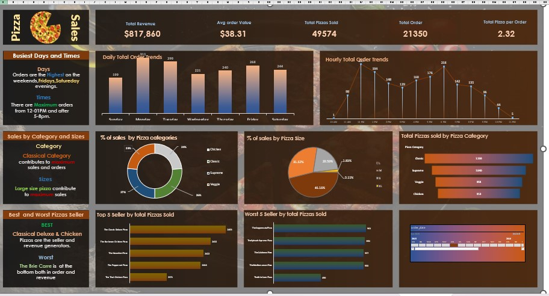

# 🍕 Pizza Sales Using Excel and SQL

## 📌 Project Overview
This project showcases how to analyze pizza sales using a combination of **Microsoft Excel** and **SQL**. It includes a ready-made **Excel dashboard** and a collection of **SQL queries** to generate key sales insights.

---

## 📁 What's Included
- 🖼️ `dashboard.jpg`: A snapshot of the interactive Excel dashboard  
- 📊 `PizzaDashboard.xlsx`: The Excel file with pivot tables, slicers, and charts  
- 📝 `SQL QUERIES.docx`: A document containing useful SQL queries to extract insights such as:
  - Total Revenue  
  - Average Order Value  
  - Total Orders & Pizzas Sold  
  - Sales Trends by Time  
  - Category & Size Performance  
  - Best and Worst Selling Pizzas

---

## 📊 Excel Features Used
- Pivot Tables  
- Charts (Bar, Pie, Line)  
- Conditional Formatting  
- Slicers for filtering  
- Dashboard Design

---

## 🧠 SQL Queries Cover
- Key Performance Indicators (KPIs)  
- Day & Hour Sales Trends  
- Sales by Pizza Size and Category  
- Top/Bottom 5 Pizzas by Sales

See: `SQL QUERIES.docx` for full queries.

---

## 📥 How to Use This Project
1. Download the Excel file and open it in **Microsoft Excel 2016 or later**.  
2. Explore interactive filters and charts in the dashboard.  
3. Use the provided SQL queries on your own **pizza_sales** database to reproduce results.

---

## 📸 Dashboard Preview

---

## 🔮 Future Enhancements
- Automate the Excel dashboard with **Power Query**  
- Create an interactive **Power BI version**  
- Add time-series forecasting and insights

---

> 💡 This project is a quick demo of real-world business data analysis using tools many professionals already have access to — Excel and SQL.
